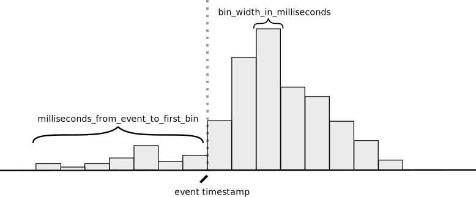
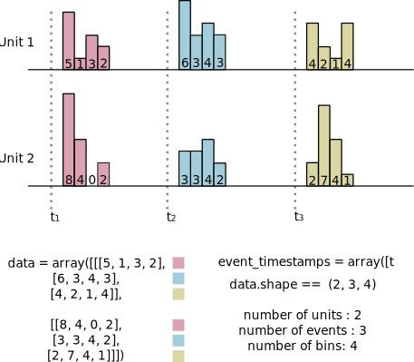

# ndx-binned-spikes Extension for NWB

⚠️ **Warning: This extension is currently in alpha and subject to change before the first release.**


## Installation
Python:
```bash
pip install -U ndx-binned-spikes
```

## Usage

The `BinnedAlignedSpikes` object is designed to store counts of spikes around a set of events (e.g., stimuli or behavioral events such as licks). The events are characterized by their timestamps and a bin data structure is used to store the spike counts around each of the event timestamps. The `BinnedAlignedSpikes` object keeps a separate count for each of the units (e.g., neurons), in other words, the spikes of the units are counted separately but aligned to the same set of events.

### Simple example
The following code illustrates the use of this extension:

```python
import numpy as np
from ndx_binned_spikes import BinnedAlignedSpikes


data = np.array(
    [
        [  # Data of the first unit
            [5, 1, 3, 2],  # First timestamp bins
            [6, 3, 4, 3],  # Second timestamp bins
            [4, 2, 1, 4],  # Third timestamp bins
        ],
        [ # Data of the second unit
            [8, 4, 0, 2],  # First timestamp bins
            [3, 3, 4, 2],  # Second timestamp bins
            [2, 7, 4, 1],  # Third timestamp bins
        ],
    ],
)

event_timestamps = np.array([0.25, 5.0, 12.25])  # The timestamps to which we align the counts
milliseconds_from_event_to_first_bin = -50.0  # The first bin is 50 ms before the event
bin_width_in_milliseconds = 100.0  # Each bin is 100 ms wide
binned_aligned_spikes = BinnedAlignedSpikes(
    data=data,
    event_timestamps=event_timestamps,
    bin_width_in_milliseconds=bin_width_in_milliseconds,
    milliseconds_from_event_to_first_bin=milliseconds_from_event_to_first_bin
)

```

The resulting object is usually added to a processing module:

```python
from pynwb.testing.mock.file import mock_NWBFile
from pynwb import NWBHDF5IO


nwbfile = mock_NWBFile()

ecephys_processing_module = nwbfile.create_processing_module(
    name="ecephys", description="Intermediate data from extracellular electrophysiology recordings, e.g., LFP."
)
ecephys_processing_module.add(binned_aligned_spikes)
```

### Parameters and data structure
The structure of the bins are characterized with the following parameters:
 
* `milliseconds_from_event_to_first_bin`: The time in milliseconds from the event to the beginning of the first bin. A negative value indicates that the first bin is before the event whereas a positive value indicates that the first bin is after the event. 
* `bin_width_in_milliseconds`: The width of each bin in milliseconds.


<div style="text-align: center;">
    
</div>

Note that in the diagram above, the `milliseconds_from_event_to_first_bin` is negative.


The `data` argument passed to the `BinnedAlignedSpikes` stores counts across all the event timestamps for each of the units. The data is a 3D array where the first dimension indexes the units, the second dimension indexes the event timestamps, and the third dimension indexes the bins where the counts are stored. The shape of the data is  `(number_of_units`, `number_of_events`, `number_of_bins`). 


The `event_timestamps` is used to store the timestamps of the events and should have the same length as the second dimension of `data`.

The first dimension of `data` works almost like a dictionary. That is, you select a specific unit by indexing the first dimension. For example, `data[0]` would return the data of the first unit. For each of the units, the data is organized with the time on the first axis as this is the convention in the NWB format. As a consequence of this choice the data of each unit is contiguous in memory.

The following diagram illustrates the structure of the data for a concrete example:
<div style="text-align: center;">

</div>


---
This extension was created using [ndx-template](https://github.com/nwb-extensions/ndx-template).
